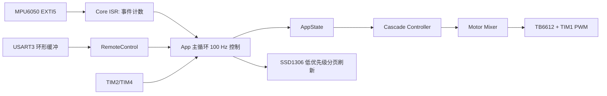

# 架构

工程采用裸机超级循环，不使用 RTOS。`Core` 只负责启动和中断入口；`App` 负责调度、状态机和协议；`BSP` 封装 STM32 外设；`Drivers` 封装器件；`Control` 是可主机测试的纯算法。

初始化顺序：NVIC 分组、板级 JTAG/SWD 配置、TIM3 时间基准、电机安全零输出、编码器、USART3、ADC、OLED、IMU/DMP、EXTI5 和 NVIC 优先级。IMU 初始化失败时只进入 `IMU_FAULT`，不会启用控制输出。

数据流是：DMP FIFO 同包提供四元数和陀螺仪 -> `ImuSample`（deg、deg/s、ms、序列号）-> 状态机授权 -> 速度 PI、角度 PD、转向 -> 混控 -> TB6612。所有方向符号集中在 `Config/board_config.h`。
